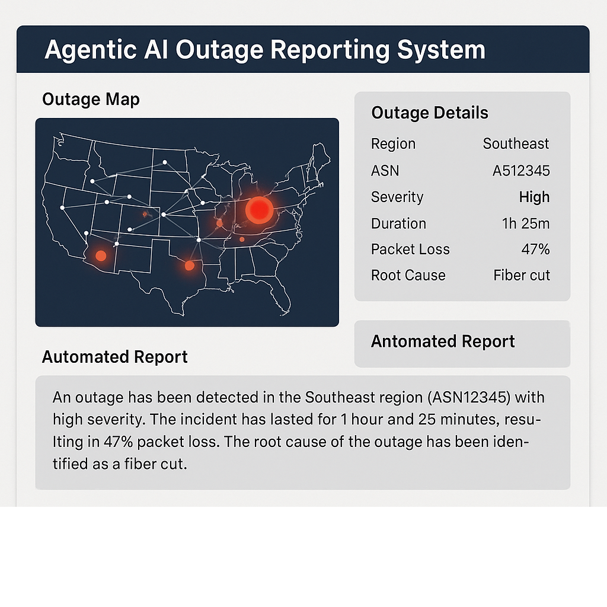

🔍 Component Overview

    agents/: Contains modular agents, each responsible for a specific task.

    configs/: Holds configuration files and prompt templates.

    data/: Stores both raw and processed data.

    outputs/: Contains the final reports and associated visuals.

    utils/: Utility functions for data fetching and visualization.

    main.py: Orchestrates the workflow by initializing agents and managing data flow.

🚀 Getting Started

    Clone the Repository:

git clone https://github.com/b18050/network-outage-reporter.git
cd network-outage-reporter

Install Dependencies:

pip install -r requirements.txt

Configure Settings:

    Update configs/config.yaml with your API keys and other settings.

Run the Application:

    python main.py

🧠 References and Inspiration

    LangChain Multi-Agent Boilerplate: denizumutdereli/langchain-multi-agents-boilerplate

    AgentScope Framework: modelscope/agentscope

    AgentVerse Platform: OpenBMB/AgentVerse
    GitHub

