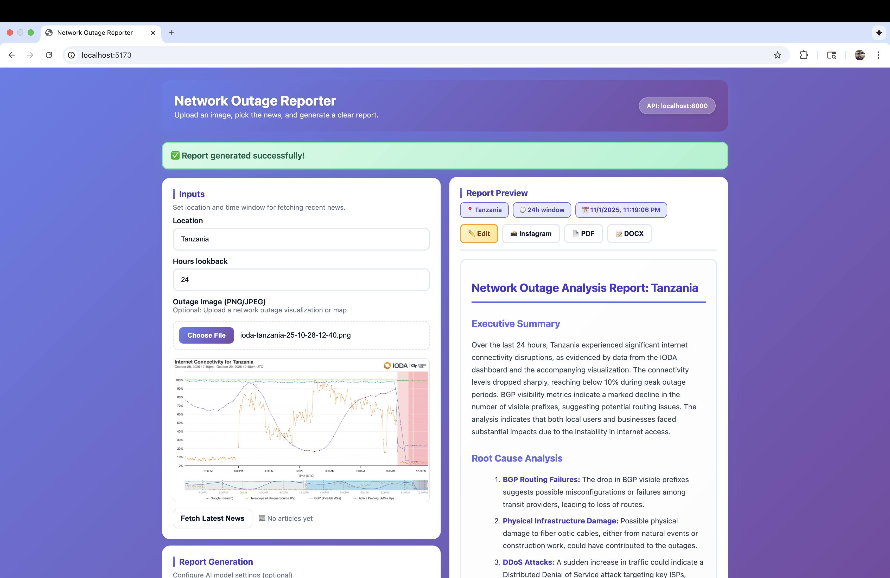

# Network Outage Analyzer

# Demo

https://github.com/user-attachments/assets/4e298aee-3b1b-4c6b-b4d6-1cc10ddb4b3b


An intelligent system for analyzing internet outages using IODA (Internet Outage Detection and Analysis) data, news articles, and OpenAI ChatGPT. Features both traditional API integration and modern MCP (Model Context Protocol) support for AI assistants.

## 🔍 Component Overview

- **agents/**: Modular agents for IODA (outage signals), news, and report generation
- **configs/**: YAML config and prompt templates
- **outputs/**: Generated reports and visuals
- **server/**: FastAPI backend for web interface
- **web/**: React frontend (Vite)
- **mcp_server.py**: MCP server for AI assistant integration
- **main.py**: CLI tool for generating reports

## ✨ Key Features

- 🌐 Real-time internet outage detection via IODA API
- 📰 Contextual news gathering for outage analysis
- 🤖 OpenAI ChatGPT-powered report generation
- 🔧 MCP (Model Context Protocol) support for AI assistants
- 🎨 Modern React web interface
- 📊 Visual outage data representation
- 🔌 Offline mode with deterministic reports

## 🚀 Getting Started

### Prerequisites
- **Python 3.9+** (Core features)
- **Python 3.10+** (Required for MCP support)
- Node.js 18+ (for web interface)
- OpenAI API key (optional, for LLM features)

### Quick Start

**Option 1: Run the test script (recommended)**
```bash
cd visara
python3 scripts/test_setup.py
```

This will verify your setup and show you what's working!

**Option 2: Interactive launcher**
```bash
./scripts/run.sh
```

### Installation

1. **Clone and install dependencies:**
```bash
git clone <repository-url>
cd visara
pip3 install -r requirements.txt
```

2. **Verify setup:**
```bash
python3 scripts/test_setup.py
```

3. **Configure API keys:**

**Recommended: Use .env file** (keeps secrets safe)
```bash
cp .env.example .env
# Edit .env and add your API keys
```

**Alternative: Set environment variables**
```bash
export OPENAI_API_KEY="sk-your-api-key-here"
export NEWSAPI_KEY="your-newsapi-key-here"  # Optional
```

**Or edit config directly** (not recommended for version control)
```yaml
# configs/config.yaml
openai_api_key: "sk-your-api-key-here"
news_api_key: "your-newsapi-key"
```

### Run It!

**CLI Mode (Generate a Report):**
```bash
python3 main.py
```
Report saved to `outputs/reports/`

**Web Mode (Start Server):**
```bash
uvicorn server.app:app --reload
```
Then visit http://localhost:8000

**Interactive Mode:**
```bash
./scripts/run.sh
```
Choose from CLI, Web, or MCP server

## 🌐 Web App (React + FastAPI)

### Backend (FastAPI)

Start the Python API server:
```bash
    uvicorn server.app:app --reload
```

Server runs at `http://localhost:8000`

### Frontend (React + Vite)

```bash
cd web
npm install
npm run dev
```

Frontend runs at `http://localhost:5173`

**Features:**
- Upload outage images (PNG/JPEG) for visual context
- Fetch and filter relevant news articles
- Generate AI-powered reports using ChatGPT
- View historical outage data visualizations

## 🔧 MCP (Model Context Protocol) Integration

This project includes an MCP server that exposes outage analysis tools to AI assistants like Claude Desktop.

### What is MCP?

MCP (Model Context Protocol) is Anthropic's open protocol that enables AI assistants to securely connect to data sources and tools. It's the future of AI integrations!

### Setup MCP Server

1. **Install the MCP package:**
```bash
pip install mcp
```

2. **Configure Claude Desktop** (or other MCP client):

Edit your Claude Desktop config file:
- **macOS**: `~/Library/Application Support/Claude/claude_desktop_config.json`
- **Windows**: `%APPDATA%\Claude\claude_desktop_config.json`

Add this configuration:
```json
{
  "mcpServers": {
    "outage-analyzer": {
      "command": "python",
      "args": ["/absolute/path/to/visara/mcp_server.py"],
      "env": {
        "OPENAI_API_KEY": "your-openai-api-key-here"
      }
    }
  }
}
```

3. **Restart Claude Desktop**

4. **Available MCP Tools:**

Once connected, Claude can use these tools:

- `fetch_outage_data` - Get IODA network outage signals
- `fetch_news` - Get relevant news articles for a location
- `get_visualization_url` - Get IODA dashboard URL
- `analyze_outage` - Comprehensive analysis (all data at once)

### Example Usage in Claude

```
Can you analyze internet outages in Turkey over the last 6 hours?
```

Claude will automatically use the MCP tools to fetch data and provide analysis!

## ⚙️ Configuration

Edit `configs/config.yaml`:

```yaml
# API Endpoints
ioda_base_url: "https://api.ioda.inetintel.cc.gatech.edu/v2"
news_api_key: "YOUR_NEWSAPI_KEY"  # Optional, from newsapi.org

# OpenAI ChatGPT
openai_api_key: ""           # Your OpenAI API key (or use env var)
use_llm: true                # Set to false for offline mode
openai_model: "gpt-4o-mini"  # Options: gpt-4o, gpt-4o-mini, gpt-3.5-turbo
temperature: 0.2             # Lower = more focused, higher = more creative
max_tokens: 800              # Max response length

# Defaults
default_location: "Sanaa, Yemen"
default_window_hours: 4      # Hours to look back for outage data
```

**Offline Mode**: Set `use_llm: false` to generate reports without API calls (deterministic template-based reports).

## 🏗️ Adding Golang Components (Optional - Great for Resume!)

Want to showcase **polyglot programming** skills? Here's how to add Go to this project:

### Recommended Go Additions:

1. **Go API Gateway** (`/go-gateway/`)
   - Rate limiting and caching
   - Request routing to Python services
   - Metrics and monitoring
   - **Why Go?** High performance, low memory footprint

2. **Go Data Collector Service** (`/go-collector/`)
   - Real-time IODA data streaming
   - WebSocket server for live updates
   - Data aggregation and buffering
   - **Why Go?** Excellent concurrency with goroutines

3. **Go CLI Tool** (`/go-cli/`)
   - Fast command-line interface for outage queries
   - Batch processing of multiple locations
   - JSON/CSV export utilities
   - **Why Go?** Single binary, fast startup, no dependencies

### Example Architecture (Python + Go):

```
┌─────────────────────────────────────┐
│    Go API Gateway (:8080)           │  ← Add this!
│  - Rate limiting (10 req/sec)       │
│  - Redis caching (5 min TTL)        │
│  - Load balancing                   │
└──────────┬──────────────────────────┘
           │
    ┌──────┴──────┐
    │             │
┌───▼────┐   ┌───▼─────────┐
│ Python │   │ Go Collector│  ← Add this!
│ FastAPI│   │ Service     │
│ + AI   │   │ (streaming) │
└────────┘   └─────────────┘
```

### Getting Started with Go:

```bash
# 1. Install Go (golang.org)
brew install go  # macOS
# or download from golang.org

# 2. Create Go workspace
mkdir go-gateway
cd go-gateway
go mod init github.com/yourusername/visara-gateway

# 3. Start with a simple reverse proxy
# See: go-gateway/README.md for tutorial
```

**Resume Impact**: Shows you understand microservices, can choose the right tool for the job, and aren't limited to one language!

## 📝 Notes

- Network calls are best-effort. Offline mode generates deterministic reports.
- Use environment variables for API keys in production.
- The system gracefully degrades if APIs are unavailable.

## 🎯 Why This Project is Great for Your Resume

### Technologies & Skills Demonstrated:

**Backend Development:**
- ✅ Python 3.10+ with modern async/await patterns
- ✅ FastAPI for RESTful APIs
- ✅ Modular agent-based architecture
- ✅ OpenAI API integration (ChatGPT)

**AI & Modern Protocols:**
- ✅ **MCP (Model Context Protocol)** - Cutting-edge AI integration (2024+)
- ✅ LLM orchestration and prompt engineering
- ✅ Multi-modal AI (text + images)

**Frontend Development:**
- ✅ React with modern hooks
- ✅ Vite for build tooling
- ✅ Responsive UI design

**System Design:**
- ✅ Microservices-ready architecture
- ✅ API integration (IODA, NewsAPI, OpenAI)
- ✅ Error handling and graceful degradation
- ✅ Offline-first design patterns

**Optional (with Go addition):**
- ✅ Polyglot programming (Python + Go)
- ✅ High-performance API gateway patterns
- ✅ Concurrent data processing
- ✅ Understanding of when to use each language

### Interview Talking Points:

1. **"Why did you build this?"** 
   - Real-world problem: analyzing internet outages for ISPs, governments, researchers
   
2. **"What was technically challenging?"**
   - Integrating multiple APIs with different formats
   - Implementing MCP protocol for AI assistants
   - Balancing offline capability with AI enhancement

3. **"How does the AI part work?"**
   - Uses ChatGPT to synthesize technical data into readable reports
   - MCP allows AI assistants to query outage data on-demand
   - Graceful fallback when AI isn't available

4. **"Why Python AND Go?"** (if you add Go)
   - Python excels at AI/ML and rapid prototyping
   - Go excels at high-performance network services
   - Shows understanding of tool selection

## 🔗 References & Learning Resources

- **IODA API**: [Internet Outage Detection and Analysis](https://ioda.inetintel.cc.gatech.edu)
- **MCP Protocol**: [Model Context Protocol](https://modelcontextprotocol.io)
- **OpenAI API**: [ChatGPT API Documentation](https://platform.openai.com/docs)
- **NewsAPI**: [News API](https://newsapi.org)
- **Go Tutorial**: [Learn Go](https://go.dev/learn/) (if adding Go components)

## 📸 Screenshots



## 📄 License

MIT License - Feel free to use this project in your portfolio!

---

**Built with ❤️ using Python, OpenAI ChatGPT, and MCP**
